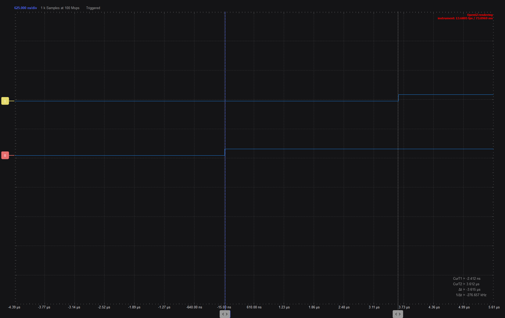
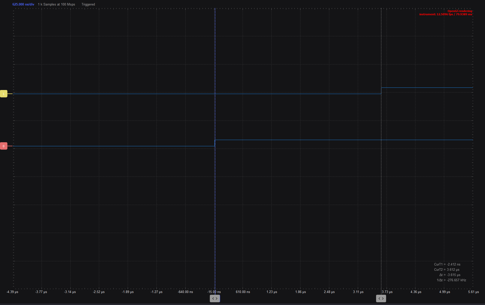
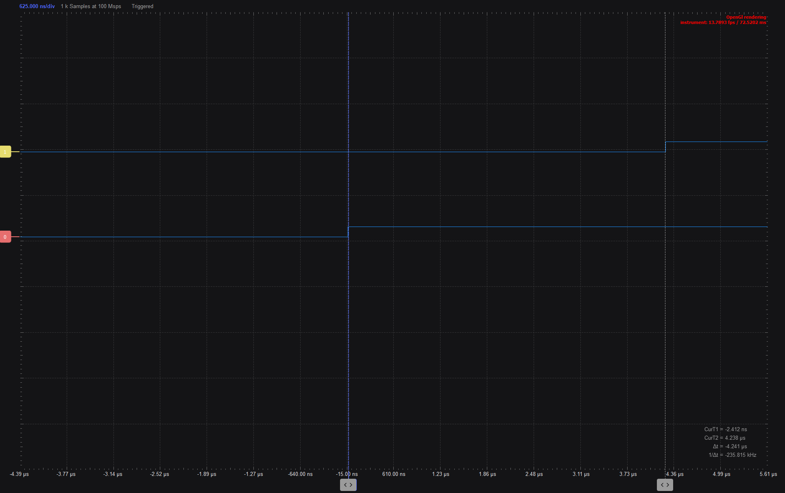
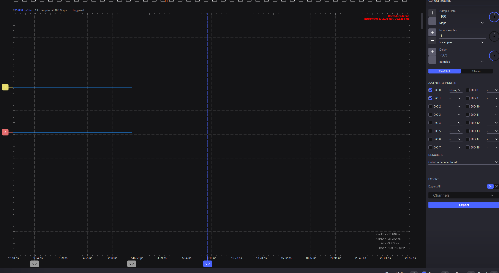

# Project 4: measuring overhead of digitalWrite() with 2 pins

1. Comparing different types of time overhead

## write a program that does the following:
- copy your code from project 3 to project 4
- Blink an LED on pin 13 with delay 1 ms
- Blink an LED on pin 12 with delay 1 ms, in this case there isn't actually a LED connected to this pin, but we can still use it to measure the overhead of the digitalWrite() function, using the logic analyzer.
- both leds should be HIGH, then delay, then both leds LOW, then delay
- connect the pins to two inputs in the logic analyzer and don't forget to add the ground connection from the Arduino to the logic analyzer.

## Exercise 1
- measure the delay between the two digitalWrite() functions using the logic analyzer.
Paste screenshots below:

enter the delay in usec here:  3.615 us

## write a 2nd program that does the following:
- based on the first program, add any calculation (adding one to an additional variable for example) and store the result in a variable between the two digitalWrite() functions.

## Exercise 2
- measure the delay the originated from the calculation between the two digitalWrite() functions using the logic analyzer.
Paste screenshots below:

if I add it after turning both of them to high, it doesnt change the delay

if i change it to between turning each of them to high:
enter the delay in usec here:  4.241 us

## Exercise 3
- Use chatGPT or similar to find how to write simultaneously to both pins. Measure the delay between the pins now. 
- Paste a screenshot below.
- Comparison of AI changes if any:

1st option:

DDRB |= _BV(DDB4) | _BV(DDB5);   // pins 12 and 13 as outputs

PORTB = _BV(PB4) | _BV(PB5);     // both HIGH together
delay(1);
PORTB = 0;                       // both LOW together
delay(1);

2nd option:
PORTB = B00110000;  // pins 12 and 13 HIGH
PORTB = B00000000;  // pins 12 and 13 LOW

## Git
 - Comparison of AI changes if any:
 - Commit and push the two programs and the README into the repository

